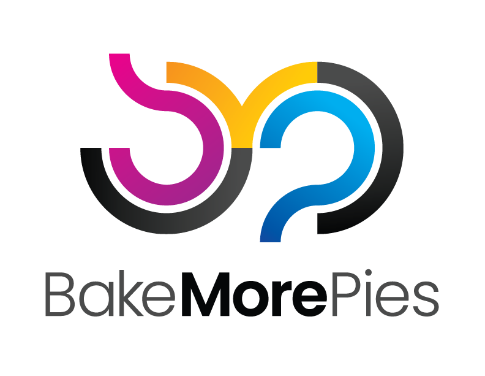

<div align="center">
  
</div>

# BakeMorePies Art & Assets 🎨✨

Welcome to the **BakeMorePies** central art repository! This repo contains all brand assets, logos, screenshots, wallpapers, and visual resources used across our GitHub packages and projects.

## 🎨 Brand Colors

Our signature Bake More Pies color palette:

- **Magenta**: `#BD1E8C` 💖
- **Yellow**: `#FFCB05` ⚡
- **Cyan**: `#00AEEF` 🌊
- **Black**: `#010101` 🖤

## 📁 Repository Structure

```
├── logos/           # BakeMorePies logos in various formats
├── screenshots/     # Application and project screenshots
├── wallpapers/      # Branded wallpapers and backgrounds
├── icons/           # Icons and small graphics
├── social/          # Social media assets and banners
└── misc/            # Other visual assets
```

## 🎯 Available Logos

### Square Logo
Perfect for profile pictures, app icons, and square formats.
```markdown

```

### Horizontal Logo  
Ideal for headers, banners, and wide layouts.
```markdown

```

## 🚀 Usage

These assets are available for use across all BakeMorePies projects and documentation. Simply reference them in your README files or documentation using the links above!

## 📝 Contributing

When adding new assets:

1. Place files in the appropriate directory
2. Use descriptive, kebab-case filenames
3. Include multiple formats when applicable (PNG, SVG, etc.)
4. Optimize images for web use
5. Update this README if adding new categories

## 📄 License

All assets in this repository are proprietary to **Bake More Pies** and are intended for internal use across our projects.

---

**Made with 💖 by the BakeMorePies team**

